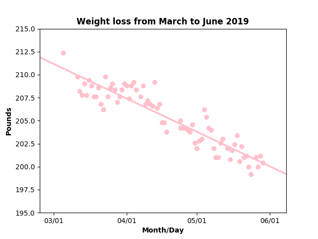
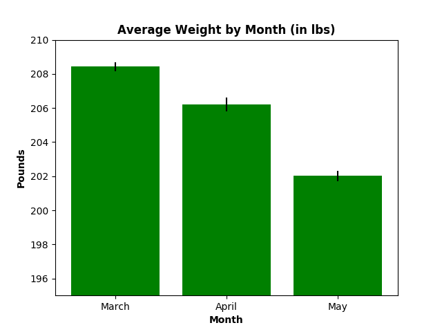
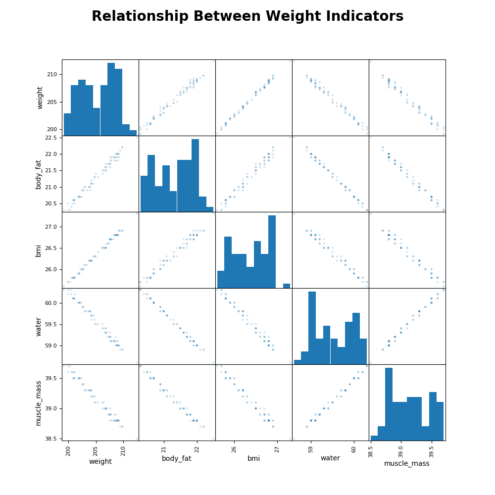

# **Plotting Weight Loss Over Time**
## Jane Stout, Ph.D.

I got ahold of some data from an individual who has been tracking their data on weight loss over the past several months. The data were collected via a smart phone app that connected to a scale with Bluetooth capabilities. I plotted this person's rate of weight change (see Figure 1), and found a clear linear decrease over time. In fact, this person steadily lost approximately thirteen pounds over the course of three months!

**Figure 1: Line Graph of Weight Loss Over Time**

The [CDC recommends] gradual weight loss (about 1 to 2 lbs per week) in order to reach and maintain a healthy body weight. This individual lost about 2 lbs during the month of March and 4 lbs during the month of April, both of which are a healthy rate of weight loss. Hurray!

**Figure 2. Bar Plot of Average Weight per Month (with standard error bars)**

I also plotted the relationship between several weight indicators including weight, body fat, body mass index (bmi), water composition, and muscle mass. As seen in Figure 3, while high body fat content and high bmi are related to a higher weight, high water and muscle mass composition are related to lower weight.

**Figure 3: Scatter Matrix of Weight Indicators**

My Python code is found [here].

[CDC recommends]: https://www.cdc.gov/healthyweight/losing_weight/index.html

[here]: weight_loss.py
